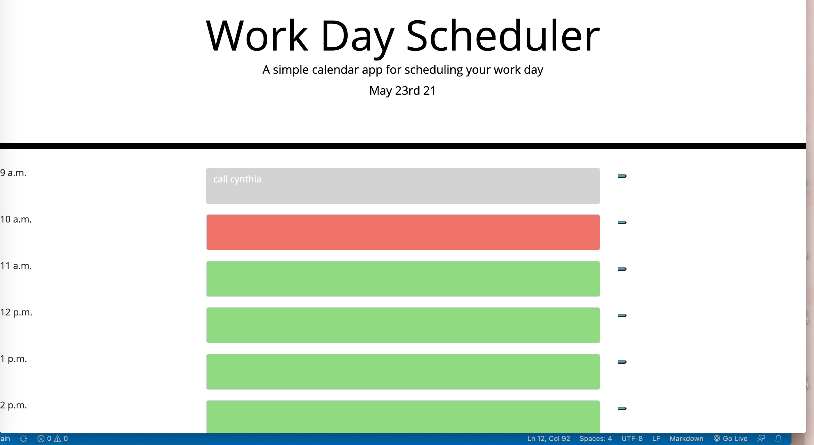

# Work-Day-Scheduler

This project is focused on creating an application that will help employees with a very busy schedule to add events to a daily planner through web application that will maanage their time effectively. This application will run in the browser featuring HTML and CSS which will be dynamically updated and will be powered by jQuery directly. The main objective is to make sure any employee that uses this to manage their schedule will be able to access their full 9-5 schedule, enter content to the text description, save that description to be seen at a later date if need be. In this codebase, you will find thorough comment descriptions describing each jQuery set up through JavaScript.

Below is an image of the Work Day Scheduler:

Here is the URL to access the application directly:
<a href="https://gracetalks.github.io/Work-Day-Scheduler/">View The Work Day Scheduler!</a>